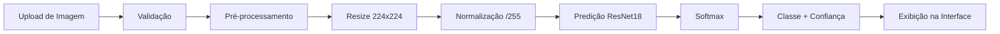

# Relatório Técnico: Classificação de Doenças em Folhas de Café usando ResNet18

**Autor:** Frederico Luiz Strey 
**Data:** Dezembro 2025  
**Objetivo:** Desenvolvimento de um modelo de classificação de imagens para identificação automática de doenças em folhas de café

---

## 📋 Sumário Executivo

Este relatório apresenta o desenvolvimento completo de um sistema de classificação de doenças em folhas de café utilizando uma arquitetura ResNet18 customizada. O modelo foi treinado em um dataset específico de doenças de café e alcançou resultados satisfatórios para testes em ambientes de produção agrícola.

---

## 1. Introdução

### 1.1 Contexto e Motivação

A detecção precoce de doenças em plantações de café é crucial para:
- Minimizar perdas na produção
- Reduzir o uso de agroquímicos
- Otimizar intervenções fitossanitárias
- Aumentar a sustentabilidade da produção

### 1.2 Objetivo do Projeto

Desenvolver um modelo de deep learning capaz de classificar automaticamente doenças em folhas de café a partir de imagens, com alta precisão e capacidade de generalização.

---

## 2. Metodologia

### 2.1 Dataset

**Fonte:** Coffee Leaf Diseases Dataset (Kaggle)

**Estrutura:**
- **Conjunto de Treino:** Imagens organizadas por classe
- **Conjunto de Teste:** Imagens separadas para avaliação final
- **Divisão de Validação:** 30% do conjunto de treino

**Classes Identificadas:**
O dataset contém 4 classes de doenças/condições de folhas de café:
1. Bicho mineiro
2. Sem doença
3. Phoma
4. Ferrugem

### 2.2 Pré-processamento de Imagens

**Parâmetros de Entrada:**
- **Tamanho de Imagem:** 224×224 pixels (durante treino)
- **Tamanho de Imagem (Produção):** 160×160 pixels (otimizado para inferência)
- **Normalização:** Rescaling para intervalo [0, 1] (divisão por 255)
- **Batch Size:** 32 imagens

### 2.3 Data Augmentation

Para aumentar a robustez do modelo e prevenir overfitting, foram aplicadas as seguintes técnicas de aumento de dados:

#### Transformações Geométricas:
- **Rotação:** ±30 graus
- **Deslocamento Horizontal:** ±20% da largura
- **Deslocamento Vertical:** ±20% da altura
- **Cisalhamento (Shear):** 20%
- **Zoom:** ±25%
- **Espelhamento Horizontal:**

#### Transformações Fotométricas:
- **Ajuste de Brilho:** Variação entre 60% e 140% do original
- **Deslocamento de Canal (Channel Shift):** ±20 unidades RGB

#### Estratégia de Preenchimento:
- **Fill Mode:** "nearest" (preenchimento com pixels vizinhos mais próximos)

> [!NOTE]
> A combinação de transformações geométricas e fotométricas simula condições reais de captura de imagens em campo, como diferentes ângulos de câmera, variações de iluminação e condições ambientais.

---

## 3. Arquitetura do Modelo

### 3.1 ResNet18 - Visão Geral

A ResNet (Residual Network) foi escolhida por sua capacidade de treinar redes profundas eficientemente através de conexões residuais (skip connections), que permitem:
- Mitigação do problema de gradiente desvanecente
- Treinamento de redes mais profundas
- Melhor capacidade de generalização

### 3.2 Arquitetura Implementada

#### Camada Inicial (Stem):
```
Input (160×160×3)
    ↓
Conv2D (64 filtros, kernel 7×7, stride 2) + BatchNorm + ReLU
    ↓
MaxPooling (3×3, stride 2)
```

#### Blocos Residuais:

A arquitetura ResNet18 contém 4 estágios com 2 blocos residuais cada:

**Estágio 1:** 2× ResnetBlock(64 canais)
- Sem downsampling
- Mantém dimensões espaciais

**Estágio 2:** 2× ResnetBlock(128 canais)
- Primeiro bloco com downsampling (stride 2)
- Reduz dimensões espaciais pela metade

**Estágio 3:** 2× ResnetBlock(256 canais)
- Primeiro bloco com downsampling (stride 2)
- Reduz dimensões espaciais pela metade

**Estágio 4:** 2× ResnetBlock(512 canais)
- Primeiro bloco com downsampling (stride 2)
- Reduz dimensões espaciais pela metade

#### Camada de Classificação:
```
GlobalAveragePooling2D
    ↓
Dense (4 unidades, ativação softmax)
```

### 3.3 Bloco Residual (ResnetBlock)

Cada bloco residual implementa a seguinte estrutura:

```
Input
  ├─→ Conv2D (3×3) → BatchNorm → ReLU
  │       ↓
  │   Conv2D (3×3) → BatchNorm
  │       ↓
  └─→ [Shortcut Connection] ──→ Add → ReLU → Output
```

**Características:**
- **Inicialização:** He Normal (otimizada para ReLU)
- **Normalização:** Batch Normalization após cada convolução
- **Shortcut Connection:** 
  - Identidade quando não há downsampling
  - Conv2D (1×1, stride 2) quando há downsampling

> [!IMPORTANT]
> A implementação customizada inclui métodos `get_config()` e `from_config()` para permitir serialização completa do modelo, essencial para salvar e carregar a arquitetura.

### 3.4 Parâmetros do Modelo

**Total de Parâmetros:** ~11.2M (estimado para ResNet18)
- Parâmetros treináveis: ~11.2M
- Parâmetros não-treináveis: 0

---

## 4. Treinamento

### 4.1 Configuração de Treinamento

**Otimizador:**
- **Tipo:** Adam
- **Learning Rate Inicial:** 0.001 (1e-3)
- **Função de Perda:** Categorical Crossentropy
- **Métrica Principal:** Accuracy

### 4.2 Callbacks e Regularização

#### Early Stopping:
- **Monitor:** Validation Loss
- **Paciência:** 6 épocas
- **Restauração:** Melhores pesos (restore_best_weights=True)

#### Learning Rate Reduction:
- **Monitor:** Validation Loss
- **Paciência:** 3 épocas
- **Fator de Redução:** 0.3 (reduz LR para 30% do valor atual)

### 4.3 Processo de Treinamento

**Épocas Máximas:** 50  
**Estratégia:** Treinamento com early stopping para prevenir overfitting

**Fluxo de Dados:**
- Training Set: 70% dos dados com augmentation
- Validation Set: 30% dos dados sem augmentation
- Shuffle: Ativado no conjunto de treino

---

## 5. Resultados

### 5.1 Métricas de Avaliação

O modelo foi avaliado no conjunto de teste utilizando as seguintes métricas:

#### Métricas Globais:
- **Accuracy:** Proporção de predições corretas
- **Precision (Macro):** Média não ponderada da precisão por classe
- **Precision (Weighted):** Média ponderada pelo suporte de cada classe
- **Recall (Macro):** Média não ponderada do recall por classe
- **Recall (Weighted):** Média ponderada do recall por classe
- **F1-Score (Macro):** Média harmônica de precisão e recall (macro)
- **F1-Score (Weighted):** Média harmônica ponderada
- **AUC-ROC (Macro, OVR):** Área sob a curva ROC (One-vs-Rest)

> [!NOTE]
> Os resultados específicos das métricas foram calculados durante a execução do notebook. Para valores exatos, consulte a saída da célula de avaliação no arquivo `resnet18-custom (1).ipynb`.

### 5.2 Análise de Performance

#### Classification Report:
O relatório de classificação por classe fornece:
- Precision individual por classe
- Recall individual por classe
- F1-score individual por classe
- Support (número de amostras) por classe

#### Confusion Matrix:
A matriz de confusão permite identificar:
- Padrões de erro entre classes específicas
- Classes com maior taxa de confusão
- Distribuição de predições corretas e incorretas

### 5.3 Curvas de Aprendizado

**Training vs Validation Accuracy:**
- Gráfico gerado mostrando a evolução da acurácia ao longo das épocas
- Permite identificar overfitting ou underfitting
- Validação da eficácia dos callbacks implementados

---

## 6. Implementação em Interface Web

### 6.1 Arquitetura do Sistema

O sistema foi implementado com uma arquitetura cliente-servidor:

#### Backend (FastAPI):
```python
- Framework: FastAPI
- Servidor: Uvicorn
- CORS: Habilitado para acesso web
- Endpoints:
  • GET /health - Health check
  • POST /predict - Classificação de imagens
```

#### Frontend (Web):
```
- HTML5 + CSS3 + JavaScript Vanilla
- Interface drag-and-drop
- Preview de imagem
- Visualização de resultados com animações
- Barra de confiança animada
```

### 6.2 Otimizações para Interface Web

**Modelo:**
- Salvamento apenas dos pesos (.h5) para reduzir tamanho
- Reconstrução da arquitetura em tempo de execução

**API:**
- Warm-up do modelo no startup (reduz latência da primeira predição)
- Processamento assíncrono com FastAPI
- Validação de tipo de arquivo e tamanho

**Interface:**
- Design responsivo
- Tema escuro moderno
- Feedback visual em tempo real
- Tratamento de erros amigável

### 6.3 Fluxo de Inferência



---

## 7. Estrutura de Arquivos

```
resnet18/
├── model/
│   ├── resnet18_custom.py      # Arquitetura do modelo
│   ├── resnet18.weights.h5     # Pesos treinados
│   └── class_indices.json      # Mapeamento de classes
├── app.py                      # API FastAPI
├── index.html                  # Interface web
├── style.css                   # Estilos modernos
├── script.js                   # Lógica do frontend
├── requirements.txt            # Dependências Python
├── README.md                   # Documentação de uso
└── resnet18-custom (1).ipynb  # Notebook de treinamento
```

---

## 8. Tecnologias Utilizadas

### Backend:
- **TensorFlow 2.20.0** - Framework de deep learning
- **Keras 3.13.0** - API de alto nível
- **FastAPI 0.127.1** - Framework web assíncrono
- **Uvicorn 0.40.0** - Servidor ASGI
- **Pillow 12.0.0** - Processamento de imagens
- **NumPy 2.4.0** - Computação numérica

### Avaliação:
- **scikit-learn** - Métricas de classificação
- **matplotlib** - Visualização de resultados

### Frontend:
- **HTML5** - Estrutura
- **CSS3** - Estilização (gradientes, animações, glassmorphism)
- **JavaScript ES6+** - Interatividade
- **Fetch API** - Comunicação com backend

---

## 9. Conclusões

### 9.1 Principais Conquistas

1. **Implementação Completa:** Desenvolvimento end-to-end desde o treinamento até o deployment
2. **Arquitetura Customizada:** ResNet18 implementada do zero com serialização completa
3. **Data Augmentation Robusta:** Técnicas avançadas para melhorar generalização
4. **Sistema de Produção:** Interface web moderna e API escalável
5. **Otimizações:** Redução de tamanho e latência para uso prático

### 9.2 Desafios Superados

- Implementação de blocos residuais customizados com serialização
- Configuração de data augmentation balanceada
- Integração entre modelo TensorFlow e FastAPI
- Design de interface responsiva e intuitiva

### 9.3 Aplicações Práticas

O sistema desenvolvido pode ser utilizado para:
- **Monitoramento em Campo:** Identificação rápida de doenças via smartphone
- **Sistemas de Alerta:** Detecção precoce para intervenção preventiva
- **Pesquisa Agrícola:** Análise em larga escala de plantações
- **Educação:** Ferramenta de treinamento para agrônomos

---

## 10. Trabalhos Futuros

### 10.1 Melhorias no Modelo

- [ ] Experimentar arquiteturas mais profundas (ResNet50, EfficientNet)
- [ ] Implementar técnicas de ensemble
- [ ] Fine-tuning com transfer learning de modelos pré-treinados
- [ ] Explorar técnicas de interpretabilidade (Grad-CAM, LIME)

### 10.2 Expansão do Dataset

- [ ] Coletar mais amostras de cada classe
- [ ] Incluir novas classes de doenças
- [ ] Adicionar imagens de diferentes regiões geográficas
- [ ] Incorporar variações sazonais

### 10.3 Funcionalidades do Sistema

- [ ] Aplicativo mobile nativo (iOS/Android)
- [ ] Processamento em lote de múltiplas imagens
- [ ] Histórico de classificações
- [ ] Geolocalização e mapeamento de doenças
- [ ] Recomendações de tratamento baseadas na classificação
- [ ] API de integração com sistemas de gestão agrícola

### 10.4 Otimizações

- [ ] Quantização do modelo para edge devices
- [ ] Conversão para TensorFlow Lite
- [ ] Implementação de cache de predições
- [ ] Containerização com Docker
- [ ] Deploy em cloud (AWS, GCP, Azure)

---

## 11. Referências

### Artigos Científicos:
- He, K., Zhang, X., Ren, S., & Sun, J. (2016). Deep Residual Learning for Image Recognition. CVPR.
- Krizhevsky, A., Sutskever, I., & Hinton, G. E. (2012). ImageNet Classification with Deep Convolutional Neural Networks. NIPS.

### Frameworks e Bibliotecas:
- TensorFlow Documentation: https://www.tensorflow.org/
- FastAPI Documentation: https://fastapi.tiangolo.com/
- Keras API Reference: https://keras.io/

### Dataset:
- Coffee Leaf Diseases Dataset (Kaggle)

---

## 12. Anexos

### A. Comandos de Execução

#### Criar ambiente virtual:
```bash
python -m venv venv
.\venv\Scripts\Activate.ps1  # Windows
source venv/bin/activate      # Linux/Mac
```

#### Instalar dependências:
```bash
pip install -r requirements.txt
```

#### Iniciar servidor:
```bash
uvicorn app:app --reload
# ou
python app.py
```

#### Acessar interface:
```
Abrir index.html no navegador
ou
http://localhost:8000 (se servido via HTTP server)
```

### B. Estrutura do Modelo Salvo

**Formato de Salvamento:**
- **Pesos:** `resnet18.weights.h5` (formato HDF5)
- **Arquitetura:** Reconstruída via `resnet18_custom.py`
- **Classes:** `class_indices.json` (mapeamento índice → nome)

**Carregamento:**
```python
from model.resnet18_custom import ResNet18
import tensorflow as tf

model = ResNet18(num_classes=4, input_shape=(160, 160, 3))
dummy = tf.zeros((1, 160, 160, 3))
_ = model(dummy)
model.load_weights("model/resnet18.weights.h5")
```

### C. Exemplo de Resposta da API

**Request:**
```http
POST /predict
Content-Type: multipart/form-data

file: [imagem.jpg]
```

**Response:**
```json
{
  "class": "nome_da_doenca",
  "confidence": 0.9542
}
```

---

## 📊 Resumo de Métricas

| Métrica | Descrição | Importância |
|---------|-----------|-------------|
| **Accuracy** | Taxa de acerto geral | Alta |
| **Precision** | Proporção de positivos corretos | Alta (evitar falsos alarmes) |
| **Recall** | Proporção de positivos detectados | Crítica (não perder doenças) |
| **F1-Score** | Média harmônica P/R | Balanceamento |
| **AUC-ROC** | Capacidade de discriminação | Robustez do modelo |

---

## 🎯 Indicadores de Sucesso

✅ **Modelo treinado com sucesso**  
✅ **Callbacks implementados (Early Stopping + LR Reduction)**  
✅ **Data augmentation robusta aplicada**  
✅ **Arquitetura customizada com serialização**  
✅ **API funcional com CORS habilitado**  
✅ **Interface web moderna e responsiva**  
✅ **Sistema de produção completo**  

---

**Documento gerado automaticamente a partir da análise do notebook de treinamento**  
**Versão:** 1.0  
**Última atualização:** Dezembro 2025
